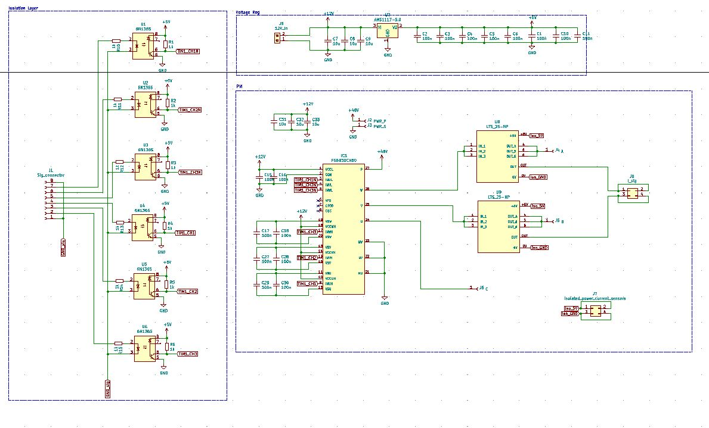
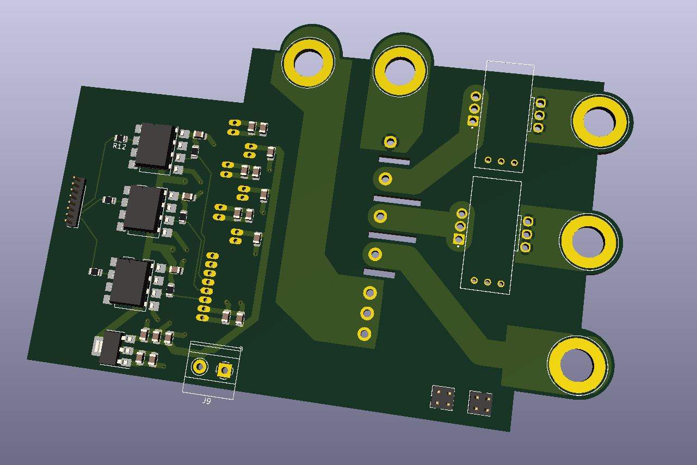

# Power_devel_board
Three phase inverter using **FSBB30CH60** power module and **LTS-25** isolated current sensor and **6N136S** as an opto-coupler to isolate the PWM signals.

# Schematic

# 3D_view

